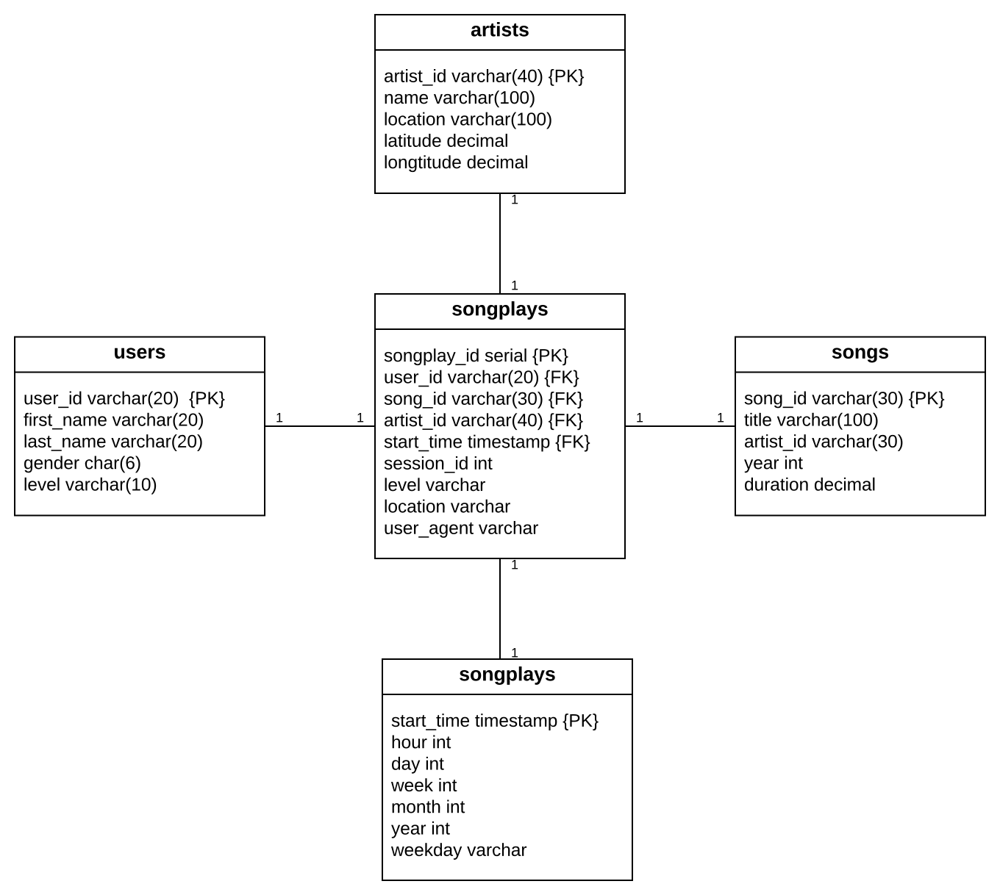
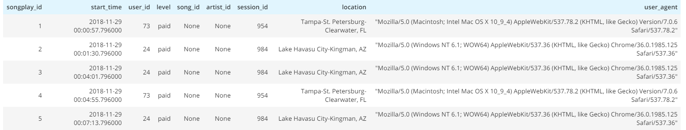
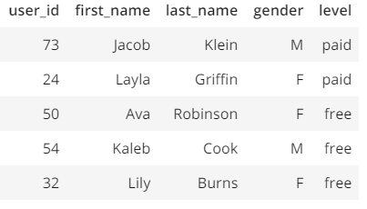
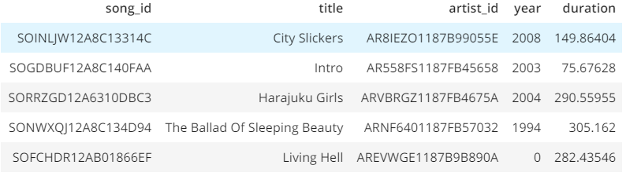
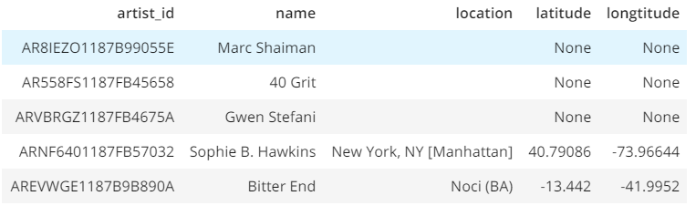
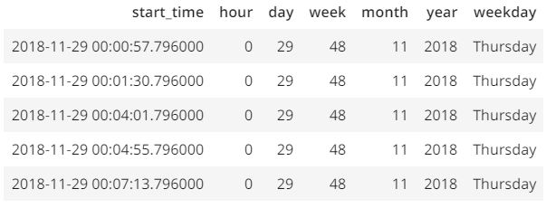

# Data Modeling with Postgres

Modeling and creating a Postgres database for collecting data about songs and user activities.

## INTRODUCTION
The goal of this project to create PostgresSQL database to Utilize songs and song plays logs for analytics team who they are particularly interested in understanding what songs users are listening to.they don't have an easy way to query their data, which resides in a directory of JSON logs on user activity on the app, as well as a directory with JSON metadata on the songs in their app. 

## Songs data and Songs play examples

song data examples
```json
{
    num_songs:1
    artist_id:"ARJIE2Y1187B994AB7"
    artist_latitude:null
    artist_longitude:null
    artist_location:""
    artist_name:"Line Renaud"
    song_id:"SOUPIRU12A6D4FA1E1"
    title:"Der Kleine Dompfaff"
    duration:152.92036
    year:0
}
```

Songs play log examples
```json
{
   "artist":null,
   "auth":"Logged Out",
   "firstName":null,
   "gender":null,
   "itemInSession":0,
   "lastName":null,
   "length":null,
   "level":"free",
   "location":null,
   "method":"PUT",
   "page":"Login",
   "registration":null,
   "sessionId":52,
   "song":null,
   "status":307,
   "ts":1541207073796,
   "userAgent":null,
   "userId":""
}
```

## Database modeling using star schema

star schema is used because of the following reasons:
    * Denormalized tables.
    * Simplified queries.
    * Fast aggregation.
    
    
    
    
## Examples of Query Reslts

```bash
%sql SELECT * FROM songplays LIMIT 5;
```

```bash
%sql SELECT * FROM users LIMIT 5;
```

```bash
%sql SELECT * FROM songs LIMIT 5;
```

```bash
%sql SELECT * FROM artists LIMIT 5;
```

```bash
%sql SELECT * FROM time LIMIT 5;
```
